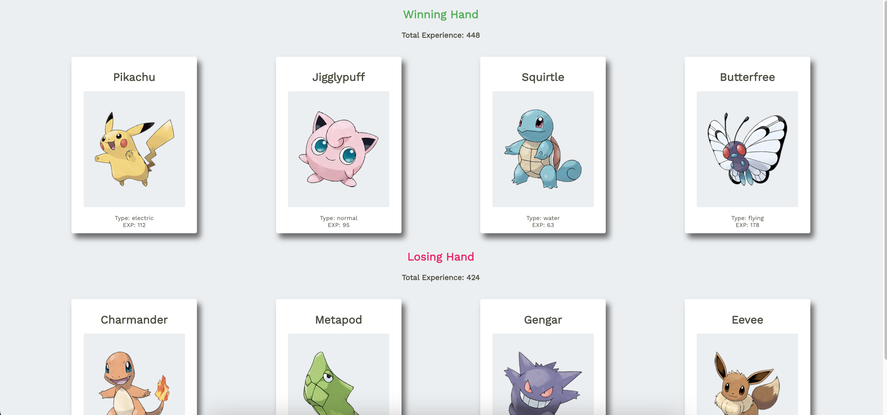

# Pokedex Project

A Pokemon application that displays winner based on total experience of Pokecards in each player's Pokedex. Each Pokedex is randomly generated with Pokecards.

## Final Product

Desktop View:

## Getting Started

1. Install dependencies using the `npm install` command.
2. Start the web server using the `npm start` command. The app will be served at <http://localhost:3000/>.
3. Go to <http://localhost:3000/> in your browser.

## Dependencies

- Express
- Node.js
- React
